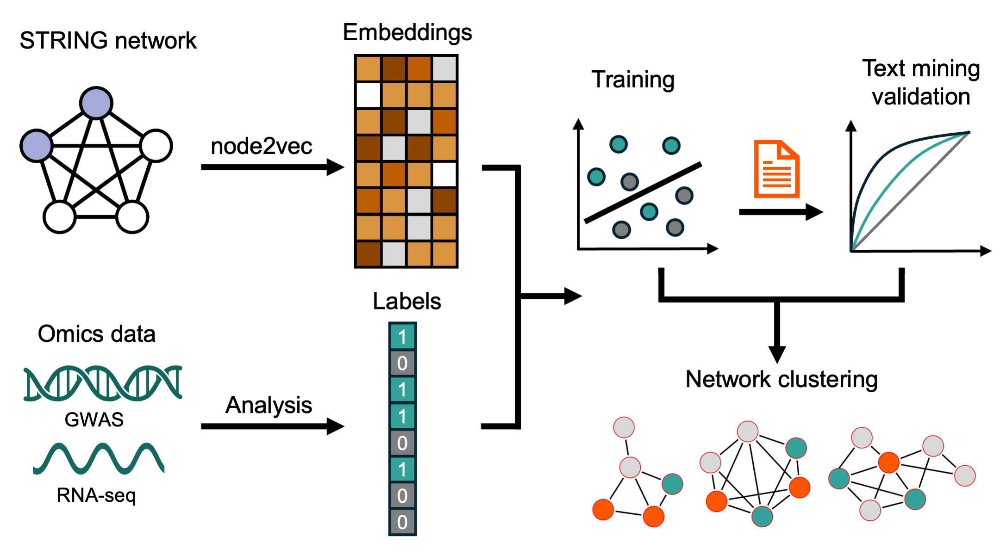

# net2rank

Repo for the manuscript: "Molecular maps of diseases from omics data and network embeddings
", where we combine omics data with network embeddings to create disease-protein association maps.




## Citation

Please cite the manuscript and the STRING database:

Our manuscript:

```
Hu, D. et al. Molecular maps of diseases from omics data and network embeddings. Preprint at https://doi.org/10.1101/2025.11.25.689280 (2025).
```

The STRING database v12.0:

```
Szklarczyk, D. et al. The STRING database in 2023: protein–protein association networks and functional enrichment analyses for any sequenced genome of interest. Nucleic Acids Research 51, D638–D646 (2023).
```

## The 64 dimensions human network embedding

[data/9606.node2vec64.h5](data/9606.node2vec64.h5)

## Installation

```bash
git clone https://github.com/larsjuhljensen/net2rank.git

#install uv
pip install uv

#install net2rank
cd net2rank
uv sync
source .venv/bin/activate
uv pip install .

# double check
which python
```

## Cross validation

```bash
python main.py cross_validation \
--train_file data/train/colorectal_adenocarcinoma.mutations.intogen.tsv \
--file_type list

python main.py cross_validation \
--train_file data/train/melanoma.mutations.intogen.tsv \
--file_type list

python main.py cross_validation \
--train_file data/train/diffuse_large_b-cell_lymphoma.mutations.intogen.tsv \
--file_type list

python main.py cross_validation \
--train_file data/train/atopic_dermatitis.integrated.tsv \
--file_type pvalue \
--pos_size 1000

python main.py cross_validation \
--train_file data/train/ulcerative_colitis.integrated.tsv \
--file_type pvalue \
--pos_size 1300

python main.py cross_validation \
--train_file data/train/focal_epilepsy.rnaseq.kjaer_guelfi_consensus.tsv \
--file_type list

## we cannot provide the olink data here, but can be download here: https://insight.olink.com/olink-data/ukb-diseases
python main.py cross_validation \
--train_file data/train/aortic_aneurysm.olink.tsv \
--file_type label
```

## Train and test

```bash
python main.py train_test \
--train_file data/train/atopic_dermatitis.integrated.tsv \
--file_type pvalue \
--test_file data/test/atopic_dermatitis.gold_standard.balanced.tsv \
--pos_size 1000

python main.py train_test \
--train_file data/train/ulcerative_colitis.integrated.tsv \
--file_type pvalue \
--test_file data/test/ulcerative_colitis.gold_standard.balanced.tsv \
--pos_size 1300

python main.py train_test \
--train_file data/train/focal_epilepsy.rnaseq.kjaer_guelfi_consensus.tsv \
--file_type list \
--test_file data/test/focal_epilepsy.gold_standard.balanced.tsv

python main.py train_test \
--train_file data/train/colorectal_adenocarcinoma.mutations.intogen.tsv \
--file_type list \
--test_file data/test/colorectal_adenocarcinoma.gold_standard.balanced.tsv

python main.py train_test \
--train_file data/train/melanoma.mutations.intogen.tsv \
--file_type list \
--test_file data/test/melanoma.gold_standard.balanced.tsv

python main.py train_test \
--train_file data/train/diffuse_large_b-cell_lymphoma.mutations.intogen.tsv \
--file_type list \
--test_file data/test/diffuse_large_b-cell_lymphoma.gold_standard.balanced.tsv

## we cannot provide the olink data here, but can be download here: https://insight.olink.com/olink-data/ukb-diseases
python main.py train_test \
--train_file data/train/aortic_aneurysm.olink.tsv \
--file_type label \
--test_file data/test/aortic_aneurysm.gold_standard.balanced.tsv

```

## Network visualization

We used Cytoscape stringAPP to visualize newtworks, and used py4cytoscape for some automation. Please check the notebook `notebooks/enrichment.ipynb` for details. If you wish to run it, you need to `pip install py4cytoscape`.
We also provided our Cytoscape session here: https://zenodo.org/records/16919169
